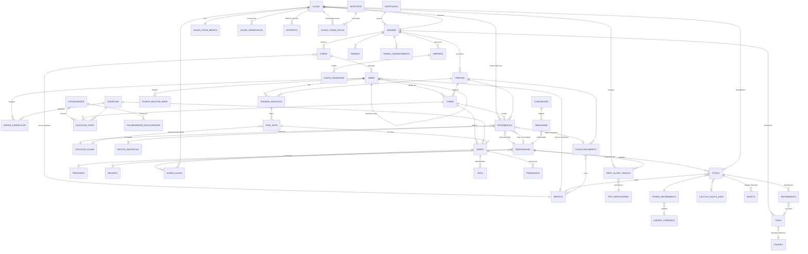

# 02 — Modelo de Dados

> **Fonte:** engenharia reversa do Activesoft SIGA (`_janus_spec/`) — 318 telas, 436 endpoints,
> 310 schemas inferidos (`ui/types.ts`, `ui/schemas.json`, `ui/glossario.md`, `api/sigaweb-public-api-swagger.json`).

> **Nota de confiabilidade:** os tipos foram inferidos a partir da UI (a maioria dos campos chega como `string` serializada; `id` é sempre `number`). Campos `st_*` e `permite_*`/`exibir_*` são booleanos serializados. Os domínios de valores marcados como *(inferido)* derivam de nomes de campos e colunas de tela, não de enums explícitos — o único enum formal capturado é `tipo_entrada_saida: E|S` na API pública.

---

## 1. Catálogo de Entidades

### 1.1 Núcleo Acadêmico — Pessoas

#### Aluno
| Campo | Tipo | Observação |
|---|---|---|
| `id` | number | PK |
| `nome`, `avatar`, `data_nascimento` | string | |
| `matricula` | ref → Matrícula | código identificador (com `prefixo_matricula` definido na Série) |
| `endereco` | ref → Endereco | objeto embutido |
| `responsavel`, `nome_responsavel` | ref → Responsável | responsável principal |
| `dadosoutrosresponsaveis` | string | demais vínculos |
| `unidade_id` | ref → Unidade | **tenant** |
| `turma` | ref → Turma | via Enturmação |
| `situação` / `status` | domínio | filtro observado: `ativo` / `inativo` |
| `status_bib`, `status_cob`, `status_fnc`, `status_obs`, `status_pdm` | string | semáforos de pendência por módulo (biblioteca, cobrança, financeiro, observações, pedagógico) |
| `camposdinamicos` | string/json | campos customizáveis |
| `gestao_presenca` | string | controle de acesso físico |

**Relacionamentos:** pertence a Unidade; N:N com Responsável (via Responsável_Aluno_Vinculado); N:N com Turma (via Alunoturma/Enturmação); 1:1 Ficha Médica; 1:N Observações/Ocorrências, Históricos, Títulos (cobrança), Descontos/Bolsas.

#### Aluno_Ficha_Medica (1:1 com Aluno)
Booleanos clínicos: `alergico`, `asmatico`, `diabetico`, `dependente_insulina`, `epiletico`, `hemofilico`, `hipertenso`, `doenca_congenita`, `em_tratamento_medico`, doenças da infância (`catapora`, `caxumba`, `coqueluche`, `escarlatina`, `rubeola`, `sarampo`), deficiências (`deficiente_auditivo/fisico/mental/visual`, `deficiencia_descricao`, `possui_laudo_medico`). Dados complementares: `tipo_sangue`, `numero_sus`, `plano_saude`/`nome_plano_saude`, `nome_medico`/`telefone_medico`/`tipo_medico`, hospital de remoção (nome/endereço/telefone), `restricoes_alimentares`, `medicacao_especifica`, `nome_remedio_febre`, `nome_parente_aavisar`, `observacoes`.

#### Responsável
| Campo | Tipo | Observação |
|---|---|---|
| `id`, `nome`, `sexo`, `data_nascimento`, `falecido` | | |
| `cpf_cnpj`, `rg` (+`rg_data_emissao`, `rg_orgao_emissor`), `passaporte`, `inscricao_estadual` | string | documentos |
| `email`, `celular`, `fone_trabalho`, `local_trabalho` | string | contato |
| `endereco_*` (logradouro, bairro, cidade, uf, cep, complemento) + `endereco_pessoas_vinculadas` | string | endereço compartilhável entre pessoas |
| `estado_civil`, `nacionalidade`, `naturalidade_cidade/uf`, `mae`, `pai` | string | |
| `profissao` | ref → Profissao | cadastro auxiliar |
| `religiao` | ref → Religiao | cadastro auxiliar |
| `unidade` | ref → Unidade | tenant |
| **Financeiro:** `dia_preferencial_pg`, `forma_recebimento`, `instrucao_boleto`, débito automático (`deb_numero_agencia`, `deb_numero_conta`, `deb_chave_autorizacao`), `banco`, `cobranca_ativa_data_proximo_contato`, `possui_cobranca_isaac_ano_atual` | | |
| **Portal/acesso:** `login`, `data_limite_expira_senha`, `mobile_permite_acesso`, `cartao_acesso`, `tem_impressao_digital`, `permissao_entrada_saida` | | |
| **LGPD:** `data_hora_aceite_termo_uso_privacidade` | | |
| `aluno_proprio_responsavel`, `funcionario` | bool | aluno maior de idade; colaborador da escola |

#### Responsavel_Aluno_Vinculado (tabela de junção N:N)
`aluno`, `responsavel`, `parentesco`, `vinculo`, `origem`, `situacao`. O vínculo carrega o **tipo de responsabilidade** (pedagógico/financeiro — ver Tipo_Responsavel). Na Enturmação aparecem `responsavel` (principal) e `responsavel_secundario`, cada um com seu `tipo_responsavel`.

#### Tipo_Responsavel (cadastro de parentesco)
`id`, `nome`, `grau_parentesco`, `grau_parentesco_descricao`, `parentesco`. **Parentesco é tabela configurável, não enum fixo** (pai, mãe, avô/avó, tio/tia, tutor etc. são dados).

#### Colaborador
`id`, `nome`, `cpf`, `matricula`, `endereco`, `ativo`, `idprofessor`/`nomeprofessor` (papel professor), `possui_turma_vinculada`, quadro de horários por dia da semana (`segunda`...`sábado`, `aula`, `horário`). Sub-entidades: **Colaborador_Escolaridade** (formação), **Colaborador_Obs** (observações), **Disciplinas Alocadas** (`disciplina`, `turma`, `ch` carga horária, `tipo de professor` primário/secundário).

#### Usuario
`id`, `email`, `celular`, `fone_trabalho`, `setor`. No contexto global: `usuario_login`, `usuario_cargo`, `usuario_grupo` (perfil de permissão), `usuario_tipo`, `usuario_operador`, `usuario_suporte`. Permissões via telas `perfis`, `verificar_permissao` (`permissao: string`).

---

### 1.2 Núcleo Acadêmico — Estrutura de Ensino

#### Instituicao → Unidade → Empresa (hierarquia organizacional)
- **Instituicao:** `id`, `nome` — grupo educacional (topo da hierarquia).
- **Unidade** (escola/campus — *o tenant operacional*): `id`, `nome`, `sigla`, endereço completo, `identificador_mec`, `estabelecimento_ensino`, `licenca_modulos`, e-mails setoriais (`email_secretaria`, `email_financeiro`), logotipos, assinaturas digitalizadas (direção/secretaria/tesouraria), dezenas de parâmetros de comportamento: regras de nota (`nota_casas_decimais`, `nota_truncar_arredondar`, escala `st_nota_01..10`), impressão de histórico por etapa (`st_imprime_historico_infantil/fundamental/medio/tecnico`), política de **impedimentos** (`tipo_impedimento_matricula`, `_web`, `_agendamento`, `_recebimento_caixa`, `_rm_online`, `_imprimir_boleto_web`), regras de caixa (`caixa_pode_liquidar_menor_maior`, `desconto_padrao_negociacao`), `tipo_calculo_multa_juros_padrao`.
- **Empresa** (entidade fiscal/CNPJ): `id`, `nome`, `cnpj` — vinculada a contas financeiras e caixas (uma unidade pode faturar por múltiplas empresas).

#### Curso
`id`, `nome`, `codigo`, `modalidade`, `oficial` (curso regular vs livre), `portaria_autorizacao`, `coordenador`, `tipo_cobranca`, `servico` (FK → Serviço de cobrança), `unidade` (FK), `codigo_integracao`. **Relacionamentos:** pertence a Unidade; 1:N Séries; 1:N Grade Curricular.

#### Serie (série/ano escolar)
`id`, `nome`, `codigo`, `curso` (FK), `servico` (FK serviço financeiro), `prefixo_matricula`, `proxima_serie` (FK auto — progressão), `educacenso_codigo_serie`, `permite_matricula_repetida`, `quantidade_dependencias`, `serie_dependencia`, `tipo_serie_alternativa`, `utiliza_avaliacao_nota/meta/relatorio`, `utiliza_rotina_educacao_infantil`, `permitir_saida_sozinho`, e **FKs para Situacao_Aluno**: `situacao_aprovado`, `situacao_cursando`, `situacao_pparcial` (progressão parcial), `situacao_reprovado`.

#### Turma
| Campo | Tipo | Observação |
|---|---|---|
| `id`, `nome`, `sigla`, `codigo`, `sala`, `vagas`, `quantidade de alunos` | | |
| `curso`, `serie`, `periodo` | FK | |
| `turno` | domínio | Manhã/Tarde/Noite (ver Tipo_Horario) |
| `tipo_horario` | FK → Tipo_Horario | grade de horários |
| `tipo_turma`, `sexo_turma`, `numero_etapa` | domínio | |
| `data_inicial`, `data_final`, `data_nascimento_minima/maxima` | date | restrição etária |
| `codigo_turma_inep` | string | censo escolar |
| `disponivel_matricula`, `quantidade_aulas_semanais`, `carga_horaria` | | |
| `modelo_contrato`, `servico_cobranca`, `valor_servico_modulo_educacao` | | vínculo financeiro |
| `situacao_aprovado/cursando/reprovado` | FK → Situacao_Aluno | override por turma |
| `novo_ensino_medio_area_conhecimento`, `_grupo_estrutura_curricular`, `it_for_nome_trilha` | | Novo Ensino Médio / Itinerários Formativos |
| `usa_conceito`, `requer_nota`, `st_gerar_historico`, `st_exibe_ata_resultados_finais` | bool | |

#### Disciplina
`id`, `nome`, `sigla`, `tipo_disciplina`, `base_comum` (BNCC: base comum vs diversificada), `agrupamento`, `numero_ordem`, `educasenso_disciplina` (mapeamento censo), `uso_escola`.

#### Grade_Curricular (Série × Disciplina × Período)
`id`, `curso_id`, `serie`, `periodo`, `disciplina`, `carga_anual`, `carga_semanal`, `carga_horaria_anual_hora_minuto`, `qtde_aula_semanal_hora_minuto`, `requer_nota`, `usa_conceito`, `exibir_boletim`/`ordem_boletim`, `exibir_ata`, `gerar_historico`, `disciplina_composta`/`tipo_composicao`/`formula_composicao` (disciplinas-mãe com componentes), `disciplina_alternativa`, `conteudo_programatico`, `tipo_aula`, campos do Novo Ensino Médio.

#### Periodo (ano/período letivo)
`id`, `nome`, `sigla`, `data_inicial`, `data_final`, `ano_conclusao`, `dias_letivos`, `semanas_letivas`, `ativo`, `proximo_periodo` (FK auto — encadeamento de anos letivos), `exibe_boletim`, `permite_alterar_nota_historico`, `disponivel_solicitacao_desconto`, `unidade` (FK).

#### Tipo_Horario (grade de horários)
`id`, `descricao`, `qtd_minutos_atraso`, e até **8 slots de aula por turno** — manhã (`m1..m8_hora_inicial/final`), tarde (`t1..t8`), noite (`n1..n8`) + `hora_inicio_turno_m/t/n`. Confirma o domínio **Turno = M | T | N**.

#### Feriado / Calendário Escolar
Feriado: `id`, `nome`, `data_feriado`, `st_efeito_financeiro`, `st_efeito_biblioteca`, `unidade` (FK). Telas de `calendario_escolar` e `calendario_eventos` (Evento capturado sem atributos).

---

### 1.3 Matrícula e Enturmação

#### Alunoturma / Enturmação (entidade central Aluno × Turma × Período)
A entidade mais rica do sistema (~60 campos):
- **Chaves:** `id_aluno_turma`, `aluno`, `turma`, `serie`, `curso`, `periodo`, `turno`, `ordem_chamada`.
- **Matrícula:** `data_efetivacao_matricula`, `plano_pagamento_matricula`, `plano_pagamento_prematricula` (distingue **pré-matrícula** de matrícula efetivada), `plano_pagamento_solicitacao_matricula_online`, `justificativa_autorizacao_matricula`, `problema_autorizado_matricula`, `usuario_autorizacao_matricula` (autorização com auditoria), `st_processamento_confirmacao_reserva_online`, `st_processamento_inscricao_em_turma`.
- **Responsáveis do vínculo:** principal e secundário, cada qual com `tipo_responsavel` (parentesco/papel).
- **Situação (3 camadas):** `situacao_aluno_turma` (FK → Situacao_Aluno, configurável), `situacao_academica`, `situacao_sistema` + `situacao_sistema_display`; situação de exceção com auditoria (`situacao_excecao_comentario`, `_data_registro`, `_id_usuario`).
- **Inativação (soft delete auditado):** `data_situacao_ativo`, `data_situacao_inativo`, `motivo_inativacao` (FK → Motivo_Inativacao), `comentario_inativacao`, `estab_ensino_inativacao` (escola destino em transferência).
- **Progressão parcial (dependência):** `exibir_progressao_parcial`, `qtd_turma_progressao_parcial`, `turma_progressao_parcial`.

#### Situacao_Aluno (cadastro de situações — meta-modelo)
`id`, `nome`, `dominio`, e mapeamentos: `situacao_sistema` (domínio interno fixo: ativo/inativo/cursando etc.), `situacao_academica` (aprovado/reprovado/cursando — usado em fórmulas), `situacao_educacenso` (mapeamento para o censo), `st_permitir_digitacao_nota_falta`, `permite_assinatura_eletronica`. **As situações de aluno são dados configuráveis por escola, mapeados para domínios de sistema** — padrão a preservar no novo sistema. Mesma lógica em **Motivo_Inativacao** (`id`, `nome`) e **Situacao_Contrato**.

#### Matricula_Online / Procedimento_Matricula
- **Matricula_Online:** formulário dinâmico — `formulario`, `agrupamento`, `campo`, `linha`, `coluna`, `definicao`, `pessoa`, `situacao` (builder de ficha de inscrição).
- **Procedimentomatricula:** documentos/etapas exigidos — `nome`, `curso`, `serie`, `periodo`, `obrigatorio`, `data_limite`, `permite_envio` (upload no portal), `exibicao_matricula_online`.
- Telas associadas: `confirmacao_matricula`, `ficha_inscricao_novatos`, `captacao`/`captacao_alunos` (funil comercial: `qtd_ganhas`, `qtd_perdidas` no dashboard), `promocao_aluno_turma` (avanço de série em lote), `finalizar_turmas`, `inativar_enturmacoes_lote`.
- **Contrato:** telas `contrato`, `contratos_financeiros`, `situacao_contratos`, `assinatura_eletronica`, `modelo_contrato` na Turma; indicador `qtd_aguardando_assinatura`.

---

### 1.4 Avaliação, Diário e Boletim

#### Sistema_Avaliacao
`id`, `nome`, `ativo`, `periodo_id`, `serie_id`/`series_vinculadas` (N:N com Séries), `qtd_fases_nota`, `sistema_avaliacao_bloqueado`, `validação`. Composto por Fases de Nota.

#### Fase_Nota (bimestre/trimestre/recuperação/exame — núcleo do motor de notas)
`id`, `nome`, `numero_fase`, `numero_ordem_exibicao`, `periodo`, `serie`, `tipo_fase_nota`, `fase_informada`/`tipo_informada` (digitada vs calculada), datas (`data_inicial/final_periodo_aula`, `data_limite_digitacao_nota`, `data_inicio_exibicao`), `numero_dias_letivos`, `numero_semanas_letivas`, **fórmulas** (`formula_nota`, `formula_falta`, `formula_composicao_nota`, `formula_aprovacao`, `formula_aprovacao_frequencia`, `calculo_formula_nota_aprovacao` + snapshots versionados `snapshot_calculo_formula_*`), **regras de resultado** (`media_minima_aprovacao`, `valor_nota_maxima`, `valor_arredondamento_media`, `situacao_aprovado`, `situacao_reprovado`, `situacao_reprovado_frequencia` — FKs para Situacao_Aluno; `fase_nota_aprovacao`, `fase_nota_reprovacao` — encadeamento entre fases), dispensa automática (`dispensar_nota_automatica`, `tipo_dispensa_automatica`), permissões do professor (`st_permite_professor_inserir_editar_avaliacao`, `_inserir_bloco`, `_importar_padrao_avaliacao`), flags de boletim (`imprimir_boletim_nota`, `_faltas`, `_nota_parcial`, `cabec_boletim`).

#### Diario (diário de classe = Turma × Disciplina × Fase)
`id`, `turma`, `disciplina`, `curso`, `serie`, `periodo`, `fase_nota` (+ datas da fase), `descricao`, `qtde_minima/maxima_aulas`, `qtd_aula_registradas`, `data_limite_digitacao`, `data_bloqueio_digitacao_aula`, `tipo_confirmacao`, `situação do diário`, `utiliza_avaliacao_nota/meta/relatorio`. **Diario_Id (aluno no diário):** `aluno`, `matrícula`, `entrada no diário`, `saída do diário`, `situação` — janela de vigência do aluno na lista de chamada. Frequência: telas `diarios--frequencia_em_lote`, `relatorio_frequencia`, `reprovacao_por_faltas`; API `marcar_frequencia_aluno`, `listar_frequencia_aluno`, `diario_frequencia`.

#### Nota / Conceito / Avaliação
Telas capturadas sem atributos detalhados (`notas`, `conceito`, `nota_conceito`, `avaliacoes`, `planilha_notas_faltas`, `alterar_notas_lote`, `reprocessamento_notas`, `reprovar_aluno_recuperacao`). API pública confirma o modelo: **CorrecaoProva** = `turma_id` + `fase_nota_id` + `disciplina_id` + lista de **CorrecaoProvaNota** (`matricula`, `nota01..nota10` decimal — até 10 instrumentos de avaliação por fase), `sobrescrever_nota`, `sobrescrever_nota_confirmada` (notas têm estado *confirmada*). Avaliações alternativas: por **competência/relatório** (`planilha_avaliacao_competencia`, ed. infantil) e por **metas**.

#### Boletim (configuração por Série × Período — Configuracoes_Serie_Periodo / Definicoes_Boletim_Serie)
`modelo_boletim`, `nome_boletim`, `sistema de avaliação` vinculado, ~45 flags `exibir_*` (faltas, frequência %, ranking, foto, filiação, fases em blocos, notas parciais, cores, disciplinas dispensadas...), `modo_agrupamento`, `ordem_disciplinas`, `orientacao_impressao`, `tamanho_fonte`, assinaturas digitalizadas, textos personalizados, `tipo_calculo_faltas`, `fase_nota_calculo_ranking`. Publicação controlada por `boletim--regras-publicacao`.

#### Historico (histórico escolar)
`aluno`, `serie_nome`, `codigo_serie`, `ano_conclusao`, `estabelecimento_ensino` (escola de origem — histórico externo), `carga_horaria_total` (+variantes hora/minuto), `dias_letivos`, `frequencia_total`, `total_faltas_texto`, `nota_minima_para_aprovacao`, `resultado_final`, `observacao`. Configuração em `configuracao--historico_escolar` e `historico_padrao`.

#### Ocorrência / Observação de Aluno
`data`, `ocorrência`, `tipos de ocorrência` (cadastro: pedagógica, disciplinar, financeira, psicológica — vide flags `st_exibir_ocorrencia_*` no portal), `observação`, `usuário de registro` (auditoria), `gera impedimento?` (bloqueio operacional), `visível ao responsável?` (visibilidade no portal).

---

### 1.5 Núcleo Financeiro

#### Titulo (cobrança/parcela a receber — entidade financeira central)
| Campo | Tipo | Observação |
|---|---|---|
| `id`, `n° do título` | | |
| `id_aluno`/`nome_aluno`/`matricula` | FK → Aluno | |
| `responsavel` | FK → Responsável | pagador |
| `servicos` | FK → Serviço | o que está sendo cobrado |
| `parcela` | ref | ex.: "01/12" (string máx. 7 na API) |
| `data_vencimento`, `data_validade`, `menor_data_faturamento` | date | |
| `valor_servico`, `valor_a_receber`, `valor_recebido`, `valor_desconto_hoje`, `valor_recebido_a_maior`, `liq_valor_devolvido` | decimal | |
| `data_pagamento`, `data_baixa`, `tipo_liquidacao`, `tipo_recebimento` | | liquidação/baixa |
| `situacao_titulo_cobranca` + `situacao_descricao` | domínio | *(inferido das colunas: em aberto / a receber / recebido / baixado / cancelado / vencido)* |
| `situacao_cobranca_registrada`, `situacao_no_agente` | domínio | status no banco/agente de cobrança |
| `forma_recebimento`, `tipo_carteira`, `nosso_numero_adicional`, `link_do_boleto` | | boleto registrado |
| `st_anuidade`, `comentario`, `turmas_vinculadas`, `possui_pendencia_isaac` | | |

**Geração via API** (`gerar_cobranca`): `id_aluno`, `id_servico`, `valor`, `vencimento`, `id_forma_recebimento`, `id_calculo_multa_juros`, `parcela`, `repetir_cobranca` (recorrência).

#### Servico (item cobrável)
`id`, `nome`, `codigo_servico`, `tipo_servico`, `servico_ativo`, `empresa_nome`. Vinculado a Curso, Série, Turma e Planos de Pagamento.

#### Planopagamento (plano de pagamento/anuidade)
`id`, `nome`, `periodo`, `unidade`, `qtde_parcelas`, `valor_servico_total`, `valor_desconto_total`, `valor_liquido_total`, `plano_anuidade`, `curso_oficial`, `servicos_vinculados` (N:N Serviços), `selecao_disponivel` (exposto na matrícula online), `possui_automacao_matricula`.

#### Desconto / Bolsa
- **Desconto (cadastro):** `id`, `nome`, `tipo_desconto`, `tipo_abatimento` *(percentual | valor — inferido)*, `percentual_desconto`, `ordem_calculo` (descontos compostos em cascata), `regra de concessão`, `dia_desconto_condicional` (pontualidade), `classificação contábil`, `ativo`.
- **Aluno_Turma_Bolsa (concessão):** `aluno`, `turma`, `serie`, `curso`, `periodo`, `bolsa`, `nome_desconto`, `percentual_abatimento` ou `valor_abatimento`, `data_inicial`/`data_final` (vigência), `data_inclusao`, `usuario_autorizacao` (auditoria), `solicitacao_desconto_origem`, `observacao`.

#### Forma_Recebimento / Agente_Cobranca
- **Formas_De_Recebimento:** `id`, `nome`, `tipo` *(boleto, PIX, cartão, dinheiro, débito automático — inferido)*, `bol_tipo_carteira`, `bol_st_carteira_homologada`, `permite_pix`, credenciamentos (`bolecode_itau`, `itau_api`, `kobana`, `bb_api`), `empresa_nome`.
- **Agente_Cobranca (banco/carteira):** `nome`, `formato_arquivo_remessa` (CNAB), `permite_cobranca_registrada`, `liquidar diretamente na escola`, `gera_impedimento`, `apenas_titulo_aberto`, forma de recebimento vinculada.
- **Calculo_Multa_Juro:** `nome`, `percentual_multa` ou `valor_multa`, `percentual_juros_ao_mes` ou `valor_juros_ao_dia`.
- **Regua_Cobranca_Automatica:** `regra de envio`, canais (`envio por e-mail`/`sms`/`mobile`), `ativa`.

#### Caixa (tesouraria)
`idcaixa`, `nomecaixa`, `idunidade`, `idempresa`, sessão de abertura (`idcaixaabertura`, `idusuarioabertura`, `datahoraabertura`, `datahorafechamento`, `saldoinicial`, `saldoatual`, `stcaixaaberto`, `stdatahoraaberturavencida`), limites de desconto no recebimento (`caixa_limitedescontoconcedidopercentual/valor`), retirada automática, recebimento por cartão (`cartao_operadora`, `qtd_parcelas`, `percentual_tarifa`, `qtd_dias_repasse`) e PIX. Relacionadas: **Tipo_Recebimento_Caixa**, **Cheque/Cheque_Custodia**, **Recebimento_Por_Cartao_Operadora** (`nome da operadora`, `conta de repasse`, `tipo de integração`), **Recebimentos_Por_Pix** (`valor pago`, `valor creditado`, `valor taxa cobrado`, `data de crédito`, `identificação do pagador`).

#### Conta_Financeira (conta bancária)
`id`, `nome`, `empresa` (FK), `unidade` (FK), `codigo_banco`, `codigo_agencia`+`agencia_dv`, `conta_corrente`+`conta_dv`, `valor_saldo_inicial`, `permite_saldo_negativo`, `usa_conciliacao_bancaria` + `data_inicio_conciliacao`, `usa_ordem_pagamento`, `disponivel_retirada_caixa`, `layout` (remessa/retorno), `integcontabil_numero_conta`, `ativa`/`situação`.

#### Contas a Pagar / Favorecido / Contabilidade
- **Contas_Pagar:** lista paginada com `total_geral`, `total_pago`; entidade **Despesa**; **Favorecido** (`nome`, `nome fantasia`, `cpf/cnpj`).
- **Plano_Conta** (plano de contas), **Centro_Resultado**, `exportacao_contabil`, `relatorios_consolidacao_contabil`, `fluxo_caixa_previsto`/`realizado`, `conciliacao_bancaria`.
- **Fiscal:** `nfse`, `nota_fiscal_servico`, `notas_fiscais` (NFS-e), `filantropia` (gratuidades/CEBAS), `recibo`.

#### Financeiro (visão consolidada por responsável/cadastro)
Agrega cadastro fiscal (CNPJ/endereço/inscrição municipal), conta, empresa, plano de contas, natureza, régua de comunicação de cobrança (e-mail/SMS/mobile com textos personalizados), totais (`total_titulos`, `total_valor_a_receber`, `total_valor_em_atraso`, `total_com_pendencia`), `gera_impedimento_financeiro`, `vinculo_isaac`.

---

### 1.6 Comunicação e Portais

#### Mensagem (fila de saída multicanal)
`id`, `tipo_mensagem` *(e-mail | SMS | mobile/push — confirmado por campos `email_*`, `sms_destinatario_celular`, `mobile_*`)*, `tipo_destinatario` *(aluno | responsável | colaborador — inferido)*, `destinatario_id`/`destinatario_nome`, `id_aluno` (contexto), `texto_mensagem`, agendamento (`data_hora_agendamento`, `data_limite_para_envio`), rastreio (`data_hora_insercao`, `data_hora_envio`, `log_envio`), e-mail (`email_assunto`, `email_remetente`, `email_com_copia`, `email_responder`, `email_usar_html`, `email_id_conta_smtp` → **Mensagem_Config_Smtp**), boleto embutido (`processar_boleto_integrado_messenger`). **Mobile_Tipo_Mensagem** é cadastro de categorias.

#### Comunicado
Listagem paginada (count/next/previous/results), com telas de criação, listagem e visualização (`comunicados--id`, `--listagem`, `--visualizar`) e seleção de público-alvo. **Conversa** (mensagens 1:1, tela `mensagens__min_mensagens_nao_lidas=0` indica contador de não lidas). **Notificacao**, **Aviso_Tela_Inicial**, **Central_Novidade** (changelog do produto, com `Central_Novidades_Visualizacao.versao` por usuário).

#### Portais
`portal_aluno`, `portal_responsavel` (pais), `portal_professor` — com **Parametro_Internet** controlando ~100 capacidades por portal: o que exibir (notas, frequência, boletim, financeiro, ocorrências por tipo, carteira de estudante, declaração de IR), o que o responsável pode alterar (CPF, RG, endereço, filiação), matrícula/rematrícula online (`rmonline_*`: mensagens por etapa, ficha médica, seleção de plano de mensalidade, serviços adicionais), inscrição em turmas, agendamentos, `bloquear_boletim_impedimento`. **Controle_De_Acesso_Portal_Resp** e **Situacao_Acesso_Portal** governam o acesso.

#### Agendamento (atendimento)
`data/hora agendamento`, `sala`, `responsável`, `situação`, `motivo do cancelamento`.

#### LGPD / Termos
**Unidade_Termo_Consentimento** e **Unidade_Termo_Uso_Imagem** (`texto`, `ativo`, `unidade`), **Termo_Uso_Privacidade** (`tipousuario`, `proprioresponsavel`), aceite registrado no Responsável (`data_hora_aceite_termo_uso_privacidade`). Endpoints auto-declarados de dados sensíveis: `/lista_alunos_dados_sensiveis/`, `/lista_responsaveis_dados_sensiveis/`.

---

### 1.7 Auxiliares e Infraestrutura
- **Cadastros auxiliares:** Profissao, Religiao, Sequencia (numeradores), Forma_Entrega_Documento, Texto_Personalizado, Gerador_Consulta (relatórios ad-hoc: `categoria`, `descricao`, `filtros`).
- **Campo_Dinamico:** campos customizáveis por escola, exibidos na ficha do aluno (`Aluno.camposdinamicos`).
- **Fila_Processamento:** jobs assíncronos (`aluno`, `turma`, `disciplina`, `data/hora inserção`, `data/hora processamento`, `erro`, `log de processamento`) — usada em planilhas de notas, registro de boletos etc.
- **Exportacao_Educacenso:** layout campo-a-campo do censo (`numerocampo`, `nomecampo`, `instrucoespreenchimento`, `stobrigatorio`, `tamanhominimo/maximo`, `valorpadrao`, `valorcampo`).
- **Relatorio_Configuracao:** modelos de relatório parametrizáveis (`modelo_relatorio`, `nome_relatorio`, `configuracoes[]`).
- **Integrações:** Isaac Pagamentos (operadores, fila de registro de títulos, status de matrícula/rematrícula, vínculo serviço↔produto), PJBank, BB API, Itaú (Bolecode/API), Kobana, PIX, ClassApp (log + sincronização), Microsoft Teams, Edebê, Metabase (dashboards embarcados via JWT), Zendesk, Educacenso/INEP.
- **Biblioteca/Livraria:** telas `biblioteca`, `livros`, `livraria` (módulo licenciável; semáforo `status_bib` no Aluno).

---

## 2. Diagrama de Relacionamentos (entidades centrais)

---

## 3. Padrões de Modelagem Observados

1. **Multi-tenancy hierárquico em 3 níveis:** `Instituicao` (grupo) → `Unidade` (escola, tenant operacional — FK `unidade`/`idunidade` presente em Aluno, Responsável, Período, Curso, Feriado, Caixa, Conta Financeira, Planos, Termos) → `Empresa` (CNPJ de faturamento, podendo haver várias por unidade). O contexto da sessão carrega `instituicao_atual_unidade`, `unidade_sigla`; dashboards Metabase recebem `sigla_da_unidade`/`id_da_unidade` no JWT. Parâmetro `financeiro_filtro_por_unidade` confirma segregação configurável. Backend aparentemente um banco por cliente (`siga04.activesoft.com.br`, `versao_banco`, `banco_de_teste`).

2. **Soft delete + ciclo de vida auditado, nunca exclusão:** padrão `ativo`/`st_ativo`/`situação` em praticamente todos os cadastros; na Enturmação a inativação exige `motivo_inativacao` (FK de cadastro), `comentario_inativacao`, `data_situacao_inativo` e guarda `estab_ensino_inativacao` (destino de transferência). `Responsavel.falecido` em vez de remoção. Operações em lote dedicadas (`inativar_enturmacoes_lote`, `cancelar_titulos_isaac_lote`).

3. **Status como meta-modelo (lookup configurável mapeado a domínio de sistema):** `Situacao_Aluno`, `Motivo_Inativacao`, `Tipo_Responsavel`, `Situacao_Contrato`, `Mobile_Tipo_Mensagem` são tabelas editáveis pela escola; cada situação customizada mapeia para um `situacao_sistema` interno + `situacao_academica` + `situacao_educacenso`. Série/Turma/Fase de Nota referenciam por FK qual situação aplicar em aprovado/reprovado/cursando/progressão parcial. **Padrão essencial a replicar.**

4. **Auditoria embutida no registro:** campos `usuario_autorizacao`, `usuario_autorizacao_matricula`, `usuário de registro`, `idusuarioabertura`, `situacao_excecao_id_usuario` + `_data_registro`, `data_inclusao`, `data_hora_insercao`/`data_hora_envio` + telas dedicadas `auditoria`, `audit`, `log`, `log_classapp`, `log_frontend`.

5. **Paginação Django REST Framework:** envelope `{count, next, previous, results}` observado em 27+ listagens (Alunoturma, Comunicado, Títulos, Contas a Pagar, Observações...). Filtros via querystring (`alunos__status=ativo`, `alunos__page=2`, `min_mensagens_nao_lidas=0`).

6. **Campos dinâmicos e formulários configuráveis:** entidade `Campo_Dinamico` + `Aluno.camposdinamicos`; matrícula online é um form-builder (campo/linha/coluna/agrupamento/definição); `Exportacao_Educacenso` modela o layout do censo como dados; `Gerador_Consulta` permite consultas ad-hoc; `Relatorio_Configuracao` parametriza relatórios.

7. **Versionamento e snapshot de regras de cálculo:** `Fase_Nota.snapshot_calculo_formula_*` congela fórmulas usadas no cálculo (reprodutibilidade de notas); `sistema_avaliacao_bloqueado` trava configuração após uso; notas têm estado *confirmada* com flag explícita de sobrescrita; `reprocessamento_notas` como operação controlada. Versão do app rastreada (`siga_version`, `versao_banco`, `versao_alpha/beta`) e novidades por versão com visto por usuário.

8. **Padrão "impedimento" (bloqueio transversal):** pendências (financeiras, biblioteca, ocorrências) geram impedimentos que bloqueiam operações configuráveis por unidade — `gera_impedimento` no Agente de Cobrança/Ocorrência/Cheque, `tipo_impedimento_matricula/_web/_agendamento/_recebimento_caixa/_rm_online/_imprimir_boleto_web` na Unidade, `bloquear_boletim_impedimento` no portal, semáforos `status_*` na listagem de alunos.

9. **Parametrização em camadas:** `Parametro_Global` (financeiro/sistema), `Parametro_Internet` (portais), parâmetros por Unidade, por Série×Período (`Configuracoes_Serie_Periodo`), por Turma — a regra mais específica prevalece. Dezenas de feature flags (`Global.funcionalidades*`, `acesso_*`, `novo_*`).

10. **Convenções de nomenclatura:** prefixo `st_` para booleanos; sufixos `_id`/`_nome`/`_sigla` (FK + desnormalização do display no payload — ex.: `curso`, `curso_nome`, `sigla_curso` juntos); decimais trafegam como string; datas `data_*`/`data_hora_*`.

11. **Encadeamento temporal:** `Periodo.proximo_periodo` e `Serie.proxima_serie` formam listas ligadas que habilitam rematrícula e promoção de turma automatizadas (`promocao_aluno_turma`, `finalizar_turmas`).

12. **Processamento assíncrono:** `Fila_Processamento` com log/erro por item para operações em lote (planilhas de nota, registro de boletos, integrações Isaac).

13. **LGPD by design (parcial):** endpoints segregados `*_dados_sensiveis`, termos de consentimento/uso de imagem por unidade com aceite datado, política de senha, controle do que o responsável vê (`visível ao responsável?` em observações).

---

## 4. Vocabulário de Domínio (escola brasileira)

| Termo | Definição no sistema |
|---|---|
| **Aluno** | Estudante; cadastro central com matrícula, situação, responsáveis, ficha médica e semáforos de pendência. |
| **Responsável** | Adulto vinculado ao aluno; pode ser pedagógico e/ou financeiro (pagador dos títulos); principal ou secundário. |
| **Tipo de Responsável / Parentesco** | Cadastro configurável do grau de parentesco e papel do vínculo (pai, mãe, tutor...). |
| **Colaborador** | Funcionário da escola; quando professor, recebe alocações de disciplina×turma e quadro de horários. |
| **Unidade** | Escola/campus; tenant operacional com seus parâmetros, logotipos e assinaturas. |
| **Instituição** | Grupo mantenedor que reúne unidades. |
| **Empresa** | Pessoa jurídica (CNPJ) usada para faturamento, contas e notas fiscais. |
| **Período (Ano Letivo)** | Exercício acadêmico com datas, dias/semanas letivas e encadeamento para o próximo. |
| **Curso** | Nível/segmento de ensino (Infantil, Fundamental, Médio, Técnico, curso livre); tem modalidade e portaria de autorização. |
| **Série** | Ano escolar dentro do curso (ex.: 1º Ano); define prefixo de matrícula, próxima série e situações de resultado. |
| **Turma** | Agrupamento de alunos de uma série em um período/turno, com vagas, sala e grade de horários. |
| **Turno** | Faixa do dia das aulas: Manhã, Tarde ou Noite (até 8 tempos de aula cada). |
| **Disciplina** | Componente curricular; classificada em base comum/diversificada (BNCC), pode ser composta (mãe + componentes). |
| **Grade Curricular** | Matriz Série×Disciplina×Período com cargas horárias, exigência de nota e exibição em boletim/histórico. |
| **Enturmação** | Vínculo do aluno a uma turma — registro central que carrega matrícula, plano de pagamento, situação e responsáveis. |
| **Matrícula** | Código identificador do aluno e ato de efetivação do vínculo (com data, autorização e usuário). |
| **Pré-matrícula / Reserva** | Etapa anterior à efetivação, com plano de pagamento próprio e confirmação online. |
| **Rematrícula (RM Online)** | Renovação do vínculo para o próximo período via portal, com etapas configuráveis. |
| **Matrícula Online** | Formulário público configurável (form-builder) de inscrição de novatos. |
| **Procedimento de Matrícula** | Documento/etapa exigida na matrícula, com obrigatoriedade e prazo de entrega. |
| **Captação** | Funil comercial de novos alunos (leads ganhos/perdidos). |
| **Promoção de Turma** | Avanço em lote dos alunos para a próxima série/período. |
| **Progressão Parcial / Dependência** | Aluno aprovado cursando disciplinas pendentes da série anterior em paralelo. |
| **Situação do Aluno** | Estado configurável (Cursando, Aprovado, Reprovado, Transferido...) mapeado a domínios de sistema, acadêmico e Educacenso. |
| **Motivo de Inativação** | Cadastro de razões de desligamento (transferência, desistência...). |
| **Sistema de Avaliação** | Conjunto de fases de nota e regras aplicado a séries em um período. |
| **Fase de Nota** | Etapa avaliativa (bimestre, trimestre, recuperação, exame final) com fórmulas, datas-limite e nota máxima. |
| **Bimestre** | Fase de nota típica de 2 meses (4 por ano). |
| **Nota / Conceito** | Resultado numérico (até 10 instrumentos por fase, decimal) ou qualitativo; passa por confirmação. |
| **Fórmula de Composição** | Expressão configurável que calcula médias, faltas e aprovação. |
| **Recuperação** | Fase de nota destinada a alunos abaixo da média (`reprovar_aluno_recuperacao`). |
| **Diário (de Classe)** | Registro de aulas, frequência e avaliações de uma turma×disciplina×fase, com janelas de digitação e bloqueio. |
| **Frequência / Falta** | Presença por aula; faltas justificadas/dispensas; reprovação por falta via percentual mínimo. |
| **Aula Dada** | Aula registrada no diário (mín./máx. por fase, conta para carga horária). |
| **Boletim** | Documento de notas/faltas por fase, com modelo, regras de publicação e dezenas de opções de exibição. |
| **Histórico Escolar** | Registro consolidado por série concluída (inclusive de escolas de origem), com carga horária e resultado final. |
| **Ata de Resultados Finais** | Documento oficial de encerramento da turma. |
| **Ocorrência** | Registro disciplinar/pedagógico/financeiro/psicológico do aluno, com visibilidade ao responsável e geração de impedimento. |
| **Ficha Médica** | Anamnese do aluno: alergias, doenças, deficiências, plano de saúde, contatos de emergência. |
| **Itinerário Formativo** | Trilhas optativas do Novo Ensino Médio, por área de conhecimento. |
| **Educacenso / INEP** | Censo escolar federal; o sistema mantém códigos e exportação campo-a-campo. |
| **Serviço** | Item cobrável (mensalidade, material, transporte...), vinculado a empresa e classificação contábil. |
| **Mensalidade / Anuidade** | Serviço educacional parcelado; plano anuidade soma o ano. |
| **Plano de Pagamento** | Pacote de serviços × quantidade de parcelas × descontos, ofertado na matrícula. |
| **Título** | Documento de cobrança (parcela a receber) com vencimento, situação, forma de recebimento e liquidação. |
| **Parcela** | Fração do título/plano (ex.: 03/12). |
| **Boleto / Cobrança Registrada** | Título registrado em banco/agente, com carteira, nosso número e situação no agente. |
| **Agente de Cobrança** | Banco/carteira que processa remessa/retorno (CNAB) e registra boletos. |
| **Forma de Recebimento** | Meio de pagamento configurado: boleto, PIX, cartão, débito automático, dinheiro. |
| **Baixa / Liquidação** | Quitação do título (total, a menor ou a maior, com devolução), manual ou por retorno bancário. |
| **Multa e Juros** | Regra de acréscimo por atraso (percentual ou valor, ao mês/ao dia). |
| **Desconto / Bolsa** | Abatimento percentual ou em valor, com vigência, ordem de cálculo, condicional de pontualidade e autorização. |
| **Régua de Cobrança** | Automação de avisos de cobrança por e-mail/SMS/app conforme regras de envio. |
| **Inadimplência** | Títulos vencidos não pagos (indicador de dashboard; alimenta impedimentos e cobrança ativa). |
| **Impedimento** | Bloqueio operacional (matrícula, boletim, portal, caixa) derivado de pendências. |
| **Caixa** | Sessão de tesouraria com abertura/fechamento, saldo, limites de desconto e retiradas. |
| **Conta Financeira** | Conta bancária da empresa, com conciliação e layouts de remessa. |
| **Plano de Contas / Centro de Resultado** | Estrutura contábil-gerencial para classificação de receitas e despesas. |
| **NFS-e** | Nota fiscal de serviço eletrônica emitida sobre os recebimentos. |
| **Filantropia** | Gestão de gratuidades/bolsas sociais para fins de certificação (CEBAS). |
| **Comunicado** | Publicação institucional segmentada para responsáveis/alunos, com confirmação de visualização. |
| **Secretaria Digital** | Emissão eletrônica de documentos escolares, com assinatura eletrônica. |
| **Portal (Aluno/Responsável/Professor)** | Acesso web/app segmentado, com capacidades controladas por parâmetros de internet. |
